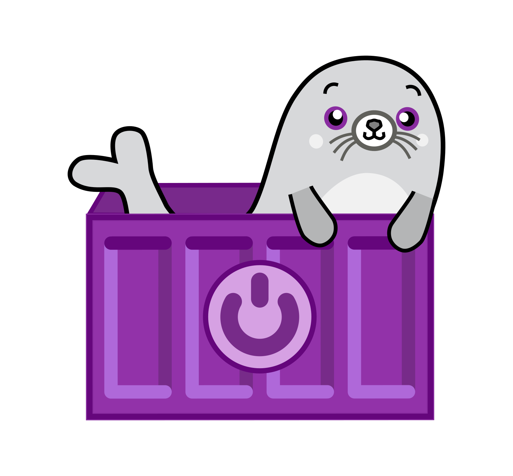

<!-- column_layout: [1, 3, 1] -->

<!-- column: 1 -->
<!-- alignment: center -->

CoreOS
========
"immutable, atomic, and container-focused operating systems"
---------------------------------------------------------------

<!-- pause -->

Operating systems based on CoreOS technologies,

<!-- pause -->

<!-- jump_to_middle -->
<!-- incremental_lists: true -->
- **Fedora CoreOS** (fcos) - Upstream
- **Red Hat Enterprise Linux CoreOS** (RHCOS) - OpenShift
- **Fedora Silverblue** - Desktop
- **Bazzite** - Gaming Desktop

<!-- pause -->
<!-- pause -->

<!-- end_slide -->

"Your OS, but Containers!"
========

<!-- pause -->

<!-- end_slide -->

CoreOS Technologies
========

<!-- reset_layout -->
<!-- column_layout: [1, 2, 1] -->

<!-- pause -->

<!-- column: 1 -->
<!-- incremental_lists: true -->
1. libostree (& rpm-ostree)
2. bootc
2. Ignition
3. Butane
4. coreos-installer

<!-- pause -->
<!-- reset_layout -->
<!-- end_slide -->

OSTree (libostree, rpm-ostree)
========
https://ostreedev.github.io/ostree/
--------------

<!-- column_layout: [1, 2, 1] -->

<!-- pause -->

<!-- column: 1 -->
<!-- incremental_lists: true -->
- "Git-like” model for **committing** and downloading bootable filesystem trees
- Content-addressed-object store (parallell with FHS)
- Checksums individual files (hashes)
- Transactional upgrades and rollback for the system 
- Files can be shared between trees via **hardlinks** (immutability constraint)
- Greatly influenced by NixOS, among other projects (shoutout Guix)

<!-- column: 0 -->

<!-- column: 2 -->

<!-- pause -->
<!-- pause -->

<!-- end_slide -->

bootc
========
https://bootc.dev/
--------------

<!-- column_layout: [1, 2, 1] -->

<!-- pause -->

<!-- column: 1 -->
<!-- incremental_lists: true -->
- libostree "frontend" and/or abstraction
- OCI Registry client
- Converts OCI-image archives (tarballs) into libostree commmits
- CLI for managing atomic upgrades and rollbacks
- Mounts `/usr` with immutable bit (read-only)
- `/etc` is mutable and persistent by default, though `/usr/lib` is recommended for static configuration
- `/var` is for persistent state

<!-- pause -->
<!-- end_slide -->

Ignition
========
https://coreos.github.io/ignition/
--------------

<!-- pause -->
<!-- pause -->
<!-- end_slide -->

Butane
========
https://coreos.github.io/butane/
--------------

<!-- pause -->
<!-- pause -->
<!-- end_slide -->

CoreOS Installer
========
https://coreos.github.io/coreos-installer/
--------------

<!-- pause -->
<!-- pause -->
<!-- end_slide -->

<!-- jump_to_middle -->
Chapter 1 - Ignition (& coreos-installer)
========
<!-- end_slide -->

<!-- jump_to_middle -->
Chapter 2 - bootc
===
<!-- end_slide -->

<!-- jump_to_middle -->
Chapter 3 - Ignition + bootc
========
<!-- end_slide -->

Resources & References
===

<!-- column_layout: [1, 2, 1] -->
<!-- column: 1 -->
- https://ostreedev.github.io/ostree/
- https://bootc.dev/
- https://coreos.github.io/ignition/
- https://coreos.github.io/butane/
- https://github.com/coreos
- https://github.com/ublue-os
- https://workshop.blue-build.org/image 

<!-- pause -->
<!-- end_slide -->

<!-- jump_to_middle -->
Questions?
===
<!-- end_slide -->

<!-- jump_to_middle -->
Thank you for listening :-)
===
